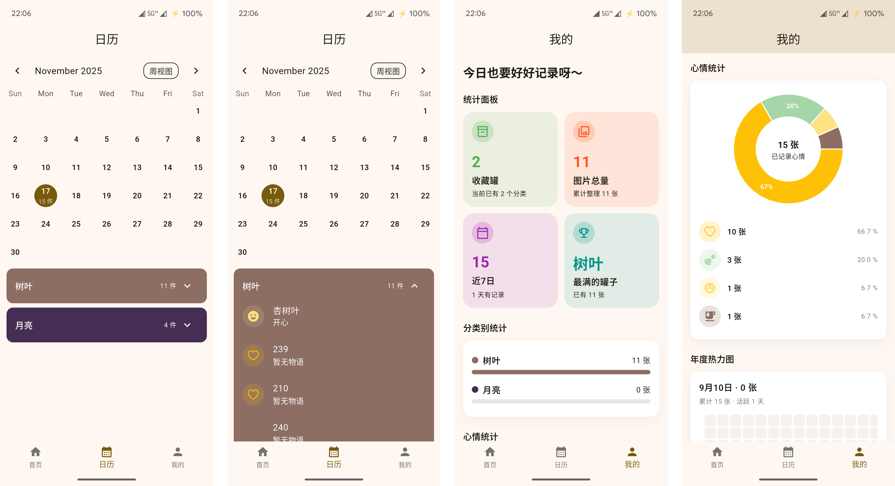

<div align="center">

# CollTank · 收藏罐

记录一切值得收藏的照片、故事与心情

</div>

## 愿景

- **沉浸式收藏体验**：以“类别 + 物品”管理收藏罐，拖拽即可重排 3×3 画框，还原「整理收藏」的仪式感。
- **全离线、可控存储**：原图严格保存在用户自选目录，Drift 数据库存储元数据，保证隐私与可迁移性。
- **统计友好**：首页内嵌本月热力图，日历页面还原每日日志，“我的”页面提供年度热力图、心情饼图、类别排行，一眼洞察收藏趋势。
- **面向长期维护的架构**：Feature+Layer 目录、Riverpod 管理状态、Drift 负责本地数据库，配合 build_runner 自动生成代码，方便拓展与协作。

## 主要功能

1. **首页 · 滚轮卡片**：左右滑动切换收集罐卡片，展示名称、描述、物品数量与本月热力图。支持进入抽屉管理、添加新罐。


2. **收集罐详情**：上方 3×3 画框 + 画框控制按钮 + 瀑布流图库。支持图片拖拽进画框、随机打乱、导出拼贴。浮动按钮轻触导入相册、长按调用相机。
3. **图片导入流程**：支持自定义目录、图库/相机二选一、手动 1:1 裁剪，落盘后同步写入 Drift，并自动生成缩略图路径。



4. **日历统计**：基于 TableCalendar 切换周/月视图，按日期高亮上传量；下半部分按收集罐折叠展示当日条目。
5. **我的页面**：统计卡片（收集罐数量、总图片数、近 7 日活跃）、年度热力图、心情饼图、分类别排行，帮助用户回顾收藏轨迹。


## 使用说明

1. **环境准备**
   - Flutter SDK ≥ 3.9.2，Dart ≥ 3.9
   - 运行 `flutter pub get` 安装依赖
   - 首次打开详情页上传图片时，需要授予外部存储 / 照片权限并指定原图目录
2. **常用命令**
   ```bash
   flutter pub get                   # 安装依赖
   flutter analyze                   # 静态检查
   flutter test                      # 运行单元/Widget 测试
   flutter pub run build_runner build --delete-conflicting-outputs  # 生成 Drift/Riverpod/Freezed 代码
   ```
3. **运行项目**
   ```bash
   flutter run
   ```
   首次导入图片需选择保存目录，建议创建 `CollTank` 文件夹，应用会在其中按收集罐 ID 划分子目录。
